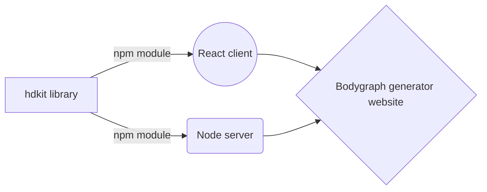

# hdkit

Welcome to the world's first Human Design programming toolkit. Originally released in 2016, the goal of hdkit is to allow you to generate bodygraphs and planetary position data.

## Quickstart

First, clone the repo:

`git clone --recursive git@github.com:jdempcy/hdkit.git`

Next, navigate to sample-apps and check out the apps. More to be added soon.

`cd sample-apps`

## Sample Apps

There are currently 5 sample apps to check out.

|                |Language/Framework                          |Description                         |
|----------------|-------------------------------|-----------------------------|
|hdblacklist-client|JavaScript, React            |Minimal front end for React-on-Rails app           |
|hdkit_sample_app|Rails |Demo for generating bodygraphs |
|pdf-maker          |JavaScript, Node, React            |Server and client for generating PDF reports            |
|rave-mandala          |HTML (SVG), JavaScript|Programatically generating an SVG Rave Mandala|
|v1          |JavaScript|Utility methods for bodygraph calculation|

Start with `hdkit_sample_app` if you are just trying to generate a bodygraph. It's very easy to set up. Simply go into the root of the project and run `bundle install` as well as `rails db:migrate`. Then you will be able to run the app just as you would run any usual Rails app, with `./bin/dev`. If you want to access Google APIs be sure to set the correct GOOGLE_API_KEY environment variable. Otherwise, you can use the default hard-coded values (bypassing the API) and see a generated bodygraph using SVG graphics as well as all the relevant data.

## Future Plans for HDKit

React/Node sample app:

Also:
- ~~Ruby on Rails sample app~~ Rails sample app complete!
- Sample scripts for outputting JSON files, and either reading JSON natively or scripts for inserting JSON into PostgreSQL database (e.g. for Rails app)
